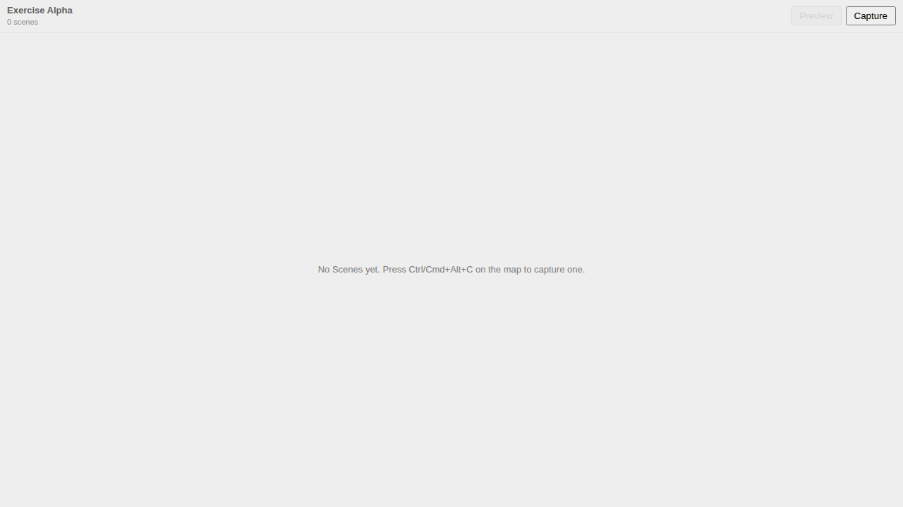

# Usage Example: Live Storyboard Preview

This feature adds a **Preview** button to the storyboard panel header on both
the desktop (VS Code) and browser (web-shell) surfaces. One click opens the
finished-briefing player in a new browser tab, playing back the **currently
active** storyboard loaded *live* — no zip-packing step.

## The author's loop

1. Open a plot with a storyboard that has at least one scene.
2. In the storyboard panel header, the **Preview** button sits beside Capture.
   (It is disabled, with an explanatory tooltip, when the active storyboard has
   no scenes.)
3. Click **Preview** → the briefing renderer opens in a new tab and begins
   playing the scenes in order (viewport framing, instant/time-range motion,
   display mode, basemap).
4. Return to the panel, tweak a scene, persist, click **Preview** again — the
   player reflects the latest persisted state.


When the active storyboard has no scenes, the button is disabled with a tooltip:



## How each surface launches the player

Both surfaces feed the renderer the same way — a features URL it `fetch`es at
launch — so the renderer code path is identical:

### VS Code (desktop) — loopback server

```text
Panel "Preview" click
  → webview posts { type: 'preview-clicked', storyboardId }
  → debrief.storyboard.preview command
  → scopeStoryboard(activePlot, storyboardId)        (shared core)
  → BriefingPreviewServer.setFeatures(scopedJson); start()   (127.0.0.1:<port>)
  → openExternal(await asExternalUri(
        'http://127.0.0.1:<port>/?features=/features.geojson'))
```

The loopback server serves the bundled renderer at `/` and the scoped features
at `/features.geojson`. It binds `127.0.0.1` only and rejects any request whose
`Host` header is not the literal loopback (DNS-rebinding defence). Fully
offline; basemap tiles degrade to the placeholder when there is no network.

### Web-shell (browser) — same-origin blob URL

```ts
// apps/web-shell/src/commands/previewStoryboardWeb.ts
const scoped = scopeStoryboard(plot, storyboardId);          // shared core
const blobUrl = URL.createObjectURL(
  new Blob([JSON.stringify(scoped.fc)], { type: 'application/geo+json' }),
);
window.open(`${BASE_URL}briefing-renderer/?features=${encodeURIComponent(blobUrl)}`,
            'debrief-briefing-preview');                     // reused named tab
```

The renderer is served same-origin under `/briefing-renderer/` (a Vite plugin
mirrors the GitHub Pages layout in dev, `vite preview`, and the static build).

## The renderer's two boot paths

```ts
// apps/briefing-renderer/src/App.tsx (simplified)
const featuresUrl = new URLSearchParams(location.search).get('features');

if (featuresUrl) {
  // #273 live preview: async fetch → validate (existing validators)
  //                    → synth item/config → store.seed → ready
  await bootBriefingRendererFromUrl(store, featuresUrl);
} else {
  // #264 air-gapped zip: synchronous inline-slot boot — unchanged,
  //                      zero network requests for storyboard data
  bootBriefingRenderer(store, { inlineData, disableDevFixture });
}
```

The two paths share the same validators and `store.seed()` but never each
other's I/O, so a distributed briefing zip still plays back offline with no
network calls — guaranteed by tests.
