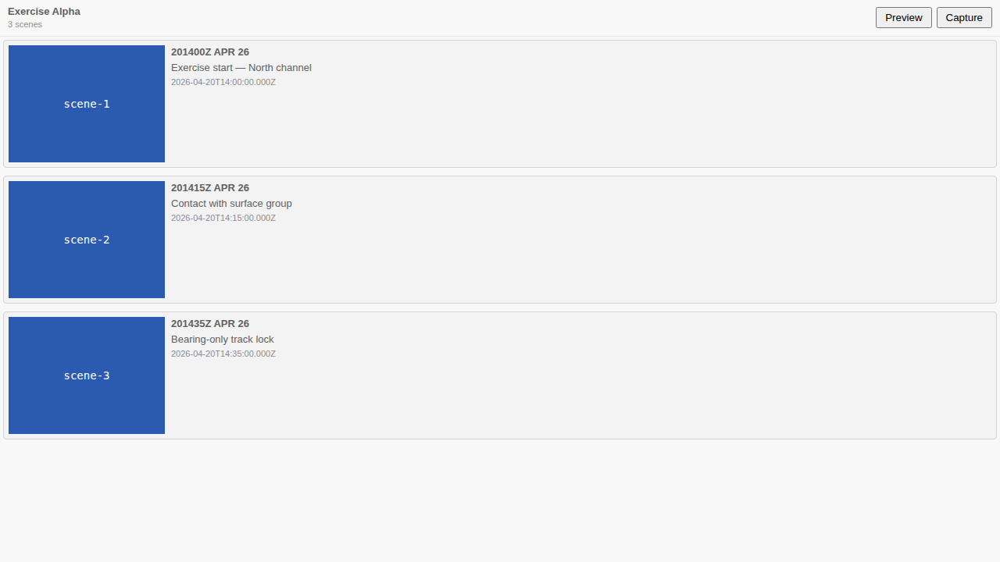

| Before — checking your briefing | After — checking your briefing |
|---|---|
| Click "Export as briefing zip" (VS Code only) | Click "Preview" (VS Code *and* the browser) |
| Save the zip somewhere | — |
| Unzip it | — |
| Double-click the player file | — |
| Watch it play back | Watch it play back, in a new tab |

## What We're Building

If you are building a briefing, the question you keep asking is a simple one: *does it actually look right when it plays?* Do the scenes transition the way you intended, does each one frame the right slice of the map, does the time-range animation run at the pace you had in mind, is the basemap the one you chose? Until now the only way to answer that with full fidelity was to export a distribution zip, save it, unzip it, and double-click a file — and even that round-trip was only available inside VS Code. Checking your work cost more clicks than making the change you wanted to check.

This adds a Preview button to the storyboard panel header, in both the VS Code extension and the browser (web-shell) app. One click opens the real briefing-renderer player in a new tab, loading your *current* storyboard live — no export, no zip, no file to manage. The same click-to-watch loop now exists everywhere you author. And as a companion, the "Export as briefing zip" capability — previously VS Code-only — comes to the browser for the first time, so the artefact you hand to someone else can be produced from either host.

## How It Fits

The briefing renderer is the same player that already ships inside exported zips (from #264), driving the playback engine built across #217, #258, and #263. What changed is *how the renderer gets its data*. It gained a second, additive boot path: alongside the existing air-gapped mode — where the storyboard JSON is inlined into the renderer's HTML at export time so a zip plays back fully offline — it can now boot from a live `?features=<url>` parameter, fetching and validating through exactly the same validators and seeding exactly the same store. The two hosts supply that URL differently (VS Code stands up an ephemeral loopback server; web-shell hands over a same-origin blob URL, building on the IndexedDB persistence from #236), but the renderer itself stays host-agnostic. This is entirely a frontend/TypeScript change — no schema touched.

## Key Decisions

- **Extend the renderer's boot path; never disturb the offline guarantee.** The inline air-gapped path that makes an exported zip play back with no network is left exactly as it was, and its tests must keep passing. The live path is purely additive — it activates only when the URL carries `?features=`. Same validators, same playback store, two ways in.

- **Let each host produce the features URL its own way.** VS Code stands up an ephemeral loopback HTTP server — a new pattern for the extension — serving the bundled renderer plus a live `/features.geojson`, opened via `asExternalUri` + `openExternal` so it still works fully offline. Web-shell needs no server at all: it uses a same-origin blob object URL, because the web-shell app and the renderer are sibling paths on the same origin in dev and on GitHub Pages alike. The renderer doesn't care which it got.

- **Export parity was cheap because the packing core was already pure.** The zip-packing logic was written as pure functions behind an injected host-dependency interface, so bringing export to web-shell meant writing one browser adapter — read through the stac-writer abstraction, deliver as a download — rather than reimplementing the packer. The pure core moves into a shared `@debrief/briefing-export` package. JSZip is already in the repo, so no new external dependency and no LinkML schema change.

## Screenshots

*The Preview button sits next to Capture in the panel header. It is active whenever the storyboard contains at least one scene.*

*When there are no scenes yet, the button is disabled and a tooltip explains why — the same pattern used elsewhere in the panel.*

## By the Numbers

The test suites covering this work:

- **70 briefing-renderer tests** — cover both the air-gapped inline boot path and the new live `?features=` path, including validator integration and store seeding.
- **44 shared briefing-export tests** — including a cross-surface zip-equivalence test that asserts VS Code and web-shell produce byte-identical archives from the same input.
- **808 VS Code unit tests** — among them 7 for the new loopback HTTP server and 4 for the preview command itself.
- **StoryboardPanel Preview-control unit tests + Storybook E2E** — cover the button's enabled/disabled state transitions and the tooltip text.
- **4 web-shell unit tests** for the preview launcher blob-URL path.

These are pass/fail suites; the numbers are test counts, not coverage percentages.

## Lessons Learned

The additive second boot path turned out to be the right framing from the start. Because the live path activates only on the presence of `?features=`, the inline offline path is structurally untouched — it imports no `fetch` at all. "Zero network for storyboard data" in the offline case is enforced by what the code doesn't import, not by an assertion in a test. That made it straightforward to keep both paths green simultaneously and meant the offline guarantee didn't need re-proving after every change to the live path.

The loopback HTTP server is new territory for the extension. Binding to 127.0.0.1 isn't sufficient on its own: a malicious page can resolve a domain it controls to 127.0.0.1 and then make requests that the browser treats as same-origin. The fix is a `Host`-header allowlist on the server — only `localhost` and `127.0.0.1` are accepted. It's not a complicated mitigation but it's easy to miss if you think "loopback binding = safe". Worth noting for any future extension work that stands up a local server.

Extracting the packing core into `@debrief/briefing-export` cost very little because the original code was already written as pure functions behind an injected dependency interface — the host-specific parts (reading a file, writing a zip entry) were passed in, not hardcoded. Moving that to a shared package was mostly a matter of updating import paths. The lesson is the familiar one: injecting I/O rather than calling it directly keeps options open in ways that aren't obvious until a second consumer appears.

## What's Next

The web-shell **Export as briefing zip** button is the remaining piece. The shared `@debrief/briefing-export` packing core is already extracted and proven host-agnostic by the cross-surface equivalence test; what remains is the browser Export UI and its static-bundle reader. That's a self-contained follow-on.

Separately, #272 (PMTiles basemaps) and #265 (MP4/GIF export) are tracked as independent workstreams and aren't blocked by anything here.

→ [See the code](https://github.com/debrief/debrief-future/tree/claude/speckit-implement-273-t2ska/specs/273-storyboard-preview-button)
