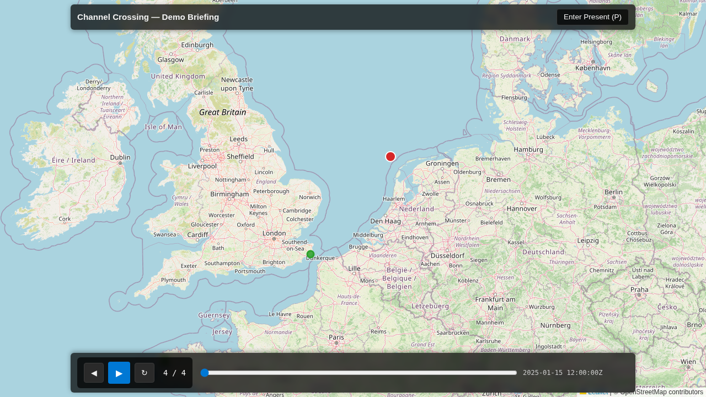
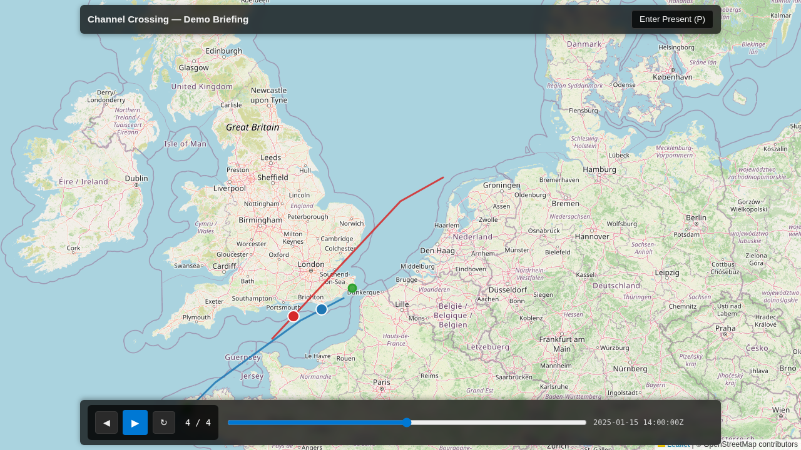

## Hook

The same Trail-mode scene, played back in an exported briefing — before and after this fix.

**Before** — the whole track is drawn from the very first frame. The author framed this scene to emphasise the approach to a contact, but every metre of the route is already on screen, with only the position dot moving:

**After** — the track now grows. At the same moment in playback, only the tail leading up to the position dot is drawn; the rest of the route reveals itself as time advances:

## What We're Building

When you compose a storyboard scene in Trail mode, you're making a deliberate narrative choice: show the recent history of each platform — the snail-trail leading up to a moment — rather than its entire route. "The minute before contact" reads very differently as a growing tail than as a fully-drawn line that was there from the start. Spec #258 taught the main application to capture that Full-vs-Trail choice per scene and honour it on playback. But the *exported* briefing — the standalone, air-gapped SPA you hand to someone who was never near the analysis environment — quietly ignored it, always drawing each platform's complete route. A scene you framed to build toward a moment played back flat, its emphasis silently discarded.

This change makes the briefing renderer honour the display mode that was captured with the scene. In Trail mode each track now grows from its start up to the current playback time, trailing the moving position dot. In Full mode — and in legacy briefings exported before display mode was a thing — the whole track shows exactly as it always has. The author's intent now survives the trip from the app preview into the shareable, offline briefing.

## How It Fits

The briefing renderer is the end of the storyboarding pipeline (epic E13): the point where a composed, scoped storyboard becomes a self-contained file someone can play back offline, with no service and no network behind it. Everything the fix needs was already there — the per-scene display mode and the per-vertex track timing are carried into the exported briefing, and the moving position dot already depends on that same timing. This was never a data-capture or export gap; it was the renderer not reading what it had been handed. The fix stays entirely on the display side: one front-end component, no schema change, no change to how scenes are captured, scoped, or exported.

## Key Decisions

- **Reuse the main app's exact trail-slicing helper rather than writing a renderer-specific copy.** The briefing calls the same `sliceTrackToTime` the in-app preview uses, so the trail in the exported file is identical in shape to what the author saw while composing — visual parity by construction, with no second implementation to drift out of step. It's an internal workspace package the renderer already pulls in transitively, so this is reuse, not a new third-party surface.

- **Grow the track as a stable-keyed map polyline whose points update in place each frame**, mirroring how the moving dot already updates, rather than rebuilding the map layer on every tick. An earlier oscillation bug (#264) came from tearing the layer down too eagerly each frame; updating positions in place keeps the growth smooth and steers well clear of that failure mode. Non-temporal context — region outlines, annotations, reference points — stays on the existing layer, untouched.

- **One predicate decides everything: a scene is Trail only if its display mode is exactly `trail`; anything else shows the full track.** Full, absent (legacy), and any unrecognised value all fall through to "show the whole route" — the safe, non-destructive default. That single rule is also why every briefing exported before #258 keeps playing back exactly as it does today.

- **A track that lacks usable per-vertex timestamps falls back to its full line — never blank, never an error — even in a Trail scene.** This reuses the same validity gate that already governs the moving dot, so a track either participates in both time-driven behaviours or neither. No half-states, no confusing empty geometry where context is expected.
