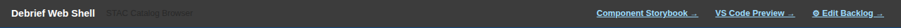
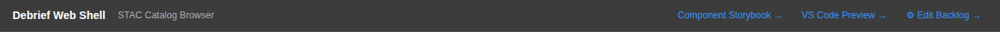
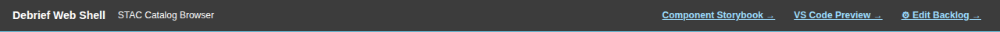
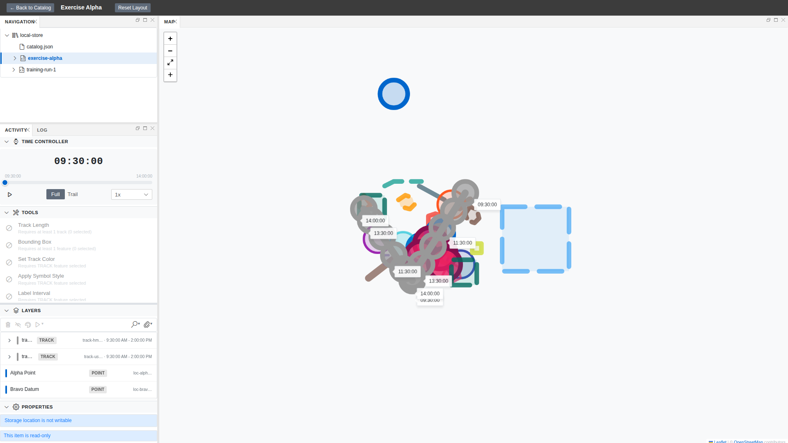
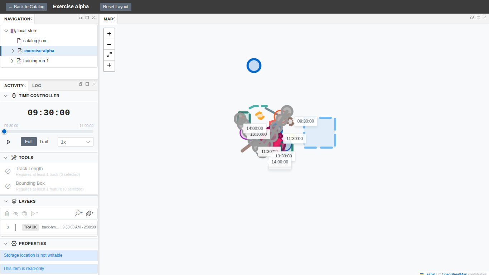
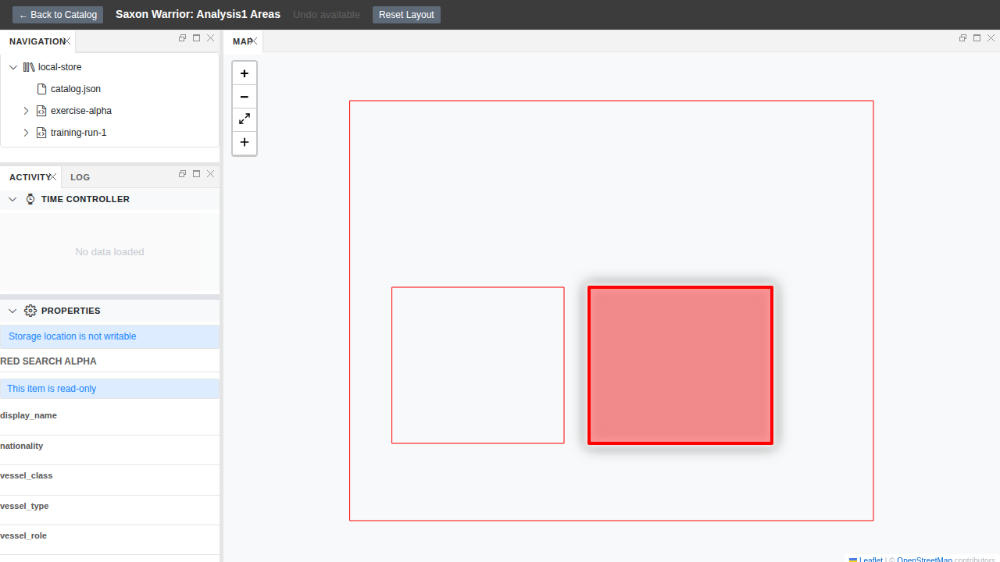
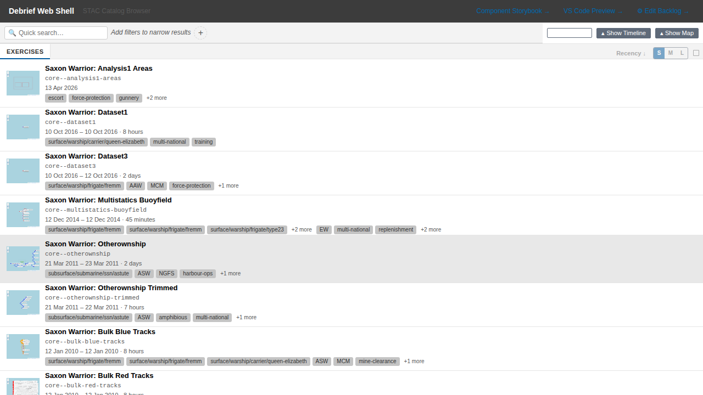
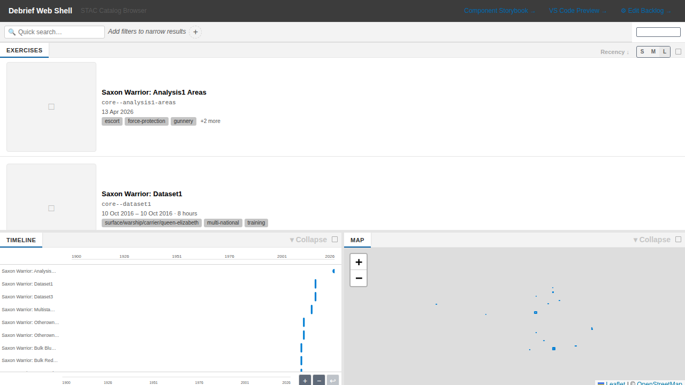

| Before | After |
|---|---|
| Activity column truncates "Apply Symbol St…" in a fixed 25% rail | Tool names show in full; the rail widens on bigger screens, map keeps the majority |
| At 1280×720 the Properties panel sits below the fold with no hint it's there | Short windows auto-collapse the upper sections so Properties is reachable |
| The S/M/L thumbnail toggle does nothing on screen | Thumbnails actually resize, and the choice sticks between visits |
| Catalog preview row hides behind a bare minus glyph | A labelled collapse/restore control with a sensible default and remembered state |
| High-contrast light header links read faint and rely on colour alone | Header links route through a theme-aware token, underlined and weighted in high-contrast modes |

## What We're Building

This is follow-up work on the UI review we ran against the web-shell — the last two open P1 items and all four P2 items from the 2026-04-26 walk-through, re-checked on 2026-06-06. None of it is a new capability. It is the seams: the truncated tool name, the panel that hides below the fold at a common laptop resolution, the size toggle that quietly did nothing, the collapse control no one would guess was a control, and the high-contrast theme links that fell short of the WCAG AAA 7:1 bar and leaned on colour alone to signal "link".

These all live on the two surfaces a first-time visitor judges us by — the catalog and the analysis view — plus the accessibility themes, which matter to a UK Defence audience where accessibility is a procurement concern rather than a nicety. Each fix is small. Together they remove the small frictions that make a tool feel unfinished, and they do it without adding a single runtime dependency.

## How It Fits

The fixes split between `apps/web-shell` (header markup and CSS, the Playwright specs that produce our before/after screenshots) and four reusable surfaces in `shared/components` — the panel-workspace default layout, the activity panel, the STAC browser, and the exercise list. Because the shared-component changes sit below the frontend boundary, the VS Code host picks them up transparently: fix the component once, both hosts benefit. That is the "thin frontends over shared components" arrangement working as intended — the host orchestrates, the component carries the behaviour.

## Key Decisions

- **No new runtime dependencies.** Every one of the six is a surgical change to code we already own. A polish pass should not grow the dependency tree.
- **localStorage for preferences, not the writer abstraction.** Panel collapse state and thumbnail size are UI-preference state, local to a browser — not domain data — so they sit outside the writer-abstraction rule and persist via localStorage.
- **Version the saved layout so it can't render broken.** The responsive default split replaces a fixed 25/75 layout, so a `LAYOUT_VERSION` bump invalidates any legacy saved layout rather than letting it restore into a broken render. No silent failure — that is Article I.
- **Evidence-first, through the test suite.** The web-shell Playwright suite is the producer of the before/after screenshots, at multiple viewports and themes. Fixing the flaky `properties-screenshots` suite (P1.4) is part of the same job — a gate that fails ~2-in-13 on first attempt hides real regressions, so we add an actionability check before the row click instead of clicking and hoping.

## Screenshots

### P1.3 — Header links in high-contrast light

The links in the web-shell title bar — "Component Storybook →", "VS Code Preview →", "Edit Backlog →" — are used by anyone on a high-contrast display. The HC-light theme renders the title bar as a fixed dark `#3c3c3c` regardless of theme; in standard and dark modes this is fine, but in HC-light the original fix applied a dark content-area blue that measured 1.22:1 against that background — almost invisible.

The corrected version routes through a bright HC token (`#9CDCFE`), measuring ~8.6:1 and clearing the WCAG AAA 7:1 bar. The links are also underlined and slightly heavier so they read as links without leaning on colour alone. The other three theme variants — light, dark, high-contrast dark — remain unchanged:

### P2.1 — Analysis layout at 1920px and 1366px

At 1920px wide the activity rail now widens to ~380px, showing tool names in full — no more "Apply Symbol St…" ellipsis. The map still keeps the majority of the screen.

At 1366px (a common office-laptop resolution) the rail tightens to ~280px, preserving map space. The rail follows discrete bands driven by the viewport width; saved custom layouts are applied verbatim on reload.

### P2.2 — Properties reachable at 720px tall

At 1280×720 with a feature selected, the upper activity sections auto-collapse so Properties arrives on screen without scrolling. No state is persisted; if the analyst manually opens a section, that wins. At ≥900px tall the adaptation is never forced.

### P2.3 & P2.4 — Catalog: collapsible preview row and resizing thumbnails

The catalog preview row now carries a labelled "▾ Collapse" control on each panel. Collapsing the row gives the exercise list the full height. "▴ Show Timeline / Show Map" restores it. The state survives a reload via localStorage.

The S/M/L thumbnail size toggle now visibly resizes the rows. Clicking each size changes the virtualiser row height immediately; the chosen size persists across reloads.

Note: interaction GIFs for the collapse and resize flows were not captured — `ffmpeg` is absent in this cloud session (the existing `videoToGif` helper skips when it's missing). The static stills above cover every scenario; no behaviour is left unverified by the test suite.

## By the Numbers

| | |
|---|---|
| Unit tests passing | 2399 |
| Skipped | 4 |
| Failed | 0 |
| Playwright specs (new suites) | 13 across 3 suites |
| Flake-proof run | 40/40 first-attempt passes (retries: 0) |
| Lint errors | 0 |
| Typecheck errors | 0 |
| New runtime dependencies | 0 |

## Lessons Learned

The contrast fix had an embarrassing first attempt. The initial change applied a dark content-area blue — perfectly readable on the light main canvas — without accounting for the fact that the web-shell's title bar is a fixed dark `#3c3c3c` in *every* theme. The axe audit caught it: 1.22:1. The point is that the audit was the executable source of truth, not the visual inspection. It took having the audit in the loop to catch an assumption that was wrong about the environment the element actually lives in.

The FR-011 test for "a saved custom layout is respected verbatim" initially used a hand-rolled GoldenLayout config object. It passed, but it was testing a toy structure. We replaced it with a config round-tripped from the real app — an actual resolved layout produced by GoldenLayout itself — and that version is a genuine contract: if the deserialisation path changes in a way that corrupts a real saved layout, this test breaks.

The flaky Playwright suite (P1.4) was failing on ~2-in-13 first attempts because the row click happened before the virtualised list had fully resolved scroll position. One `await expect(row).toBeVisible()` + `scrollIntoViewIfNeeded()` before the click, and 40 consecutive first-attempt runs pass at `retries: 0`. The 15-second form-wait is still there, so a genuine breakage still fails loudly.

## What's Next

The P3 items from the original review remain out of scope. No further UI review follow-up work is planned unless the next walk-through surfaces regressions.

→ [See the code](https://github.com/debrief/debrief-future/pull/281)
