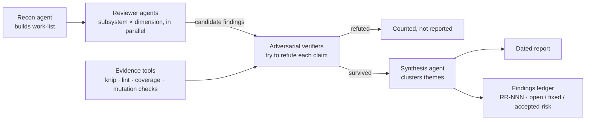

## Hook

## What We're Building

Future Debrief now has around 200 delivered features behind it — roughly 230 Python files and 1,300 TypeScript files, built one spec at a time through the speckit workflow. Each feature gets reviewed on its way in, and that per-feature discipline has held up well. What nothing does is step back and ask whether the whole still hangs together: does the constitution still match what's actually in the codebase? Have the tech-debt gains from the March review quietly eroded? Are there tests that pass without testing anything?

This feature is a reusable `/repo-review` skill that audits the entire repository across those four dimensions — constitution conformance, correctness bugs, tech-debt regression against the #172 baseline, and test quality. The distinguishing rule is that every candidate finding must survive an adversarial verification pass, where a second agent actively tries to refute it, before it can appear in the report. Refuted candidates get counted, not listed. The bet is simple: a report I can act on without re-checking every claim is worth more than a longer report I can't trust. Output is a dated report plus a machine-readable findings ledger with stable IDs (RR-NNN) and statuses, so the next run reports what changed rather than rediscovering the same issues. A companion `/repo-review.fix RR-NNN` skill takes any ledger finding straight into the fix → test → PR flow. There's an obvious recursion here that I find genuinely interesting: this is a fleet of agents auditing a codebase that was itself largely built by agents — and the adversarial layer exists precisely because unverified AI findings are noise.

## How It Fits

The implementation is skill assets, not runtime code — two command files, four dimension playbooks with a severity rubric and tier map under `.claude/review/`, and one small typed Python helper for the ledger. Zero new dependencies, and nothing in the shipped product changes. What it plugs into is the project's institutional memory: the constitution supplies the conformance rules being checked, the #172 tech-debt review supplies the regression baseline, and confirmed findings flow back out into `bugs.md` and failure-pattern docs so the knowledge outlives any single run. The review's write boundary is deliberately hard — it reports, it never fixes — with all remediation flowing through the separate fix skill. The honest success metric isn't findings count; it's the resolution rate by the next run.

## Key Decisions

- **Verified-only signal bar.** Every finding survives an adversarial refutation pass before it enters the report. This trades recall for precision on purpose — a shorter report the maintainer trusts beats a longer one that needs re-checking.
- **Streaming pipeline with one barrier.** Recon builds a work-list of subsystem × dimension cells; reviewer agents stream candidates to verifiers with no synchronisation point between them. The single legitimate barrier is theme clustering at synthesis, because clustering needs the full picture.
- **Evidence tools ground the claims.** Verifiers lean on knip dead-code analysis, dependency audits, stricter-than-CI lint configs (report-only), coverage data, and mutation spot-checks that deliberately break code in a disposable git worktree to prove a suspicious test would actually fail.
- **The ledger is hand-editable YAML, validated by a typed helper.** Only the helper and the maintainer write it. A corrupt ledger halts the run rather than being silently regenerated — losing finding history would defeat the whole delta-reporting design.
- **Reconciliation matches by defect identity, not line numbers.** Findings carry a dimension + module + defect slug; line numbers churn far too fast across ~1,500 files to serve as identity.
- **Prevention over cure.** Synthesis must propose one permanent guard per finding theme — a lint rule, CI gate, CLAUDE.md instruction, or constitution amendment. This is the ADR-033 pattern: one incident becomes a standing rule.
- **A tier map focuses the effort.** The deepest review goes to `shared/schemas` plus the generators and the Python services — the data-integrity spine — with lighter passes elsewhere.
