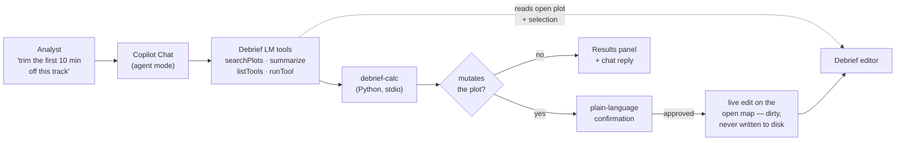

## Hook

## What We're Building

I wanted to know what it feels like to *talk* to Debrief. So this spike wires GitHub Copilot Chat, in agent mode, directly into the VS Code extension: you type "find me the exercises off the Solent" or "trim the first ten minutes off this track", and Copilot does it — searching the local STAC catalogue, opening a plot, and running Debrief's own Python analysis tools against whatever you have open. The extension registers four tools with VS Code's Language Model Tools API, so Copilot discovers them the same way it discovers any other agent tool, and every call flows back through the extension — which means the chat always knows which plot is open and what you have selected.

The honest framing up front: this is an experiment, not a product. Copilot is cloud-backed, and Debrief's constitution is offline-by-default, so nothing here ships as-is. The point is to learn how a chat agent actually drives Debrief through a tool surface — where it stumbles, what a plot summary costs in tokens, how different models cope — so the real prize, an in-Debrief natural-language panel that runs against a *local* model, has something concrete to build on.

## How It Fits

This is the reconnaissance run for epic E13 — the offline NL panel (spike #235). Rather than inventing a bespoke chat surface to prototype against, it borrows one that already exists (Copilot agent mode) and points it at the tool boundary the future panel will also have to speak to. Search reuses the same `stacService.listItems` and `debrief.openPlot` command the file tree already uses; tool execution reuses the exact `debrief-calc` Python stdio path the Tools panel already drives. Everything Copilot-specific lives quarantined in a new `src/copilot/` folder, and the spike ships learning instrumentation — per-invocation telemetry, a token-budget probe, a multi-model comparison, a domain-priming A/B — all feeding a findings report that outlives the throwaway code.

## Key Decisions

- **Language Model Tools API over an MCP server or a `@debrief` chat participant.** All three could expose the tools, but only the extension-mediated LM Tools path lets each call carry live editor context — the open plot, the current selection — without the model having to name a file. That context is the whole reason the interaction feels like driving Debrief rather than querying a database.
- **Chat edits never touch disk.** This is the single most important safety decision. Where the Tools panel writes results straight to the STAC store, chat edits apply only to the open editor's in-memory features and mark the session dirty. You review and save exactly as you would a manual edit — nothing is written from a chat turn. Read tools auto-run; anything that *modifies* the plot gates on a plain-language confirmation first. Default-strict, defence-grade.
- **A meta-tool pair fronts the tool registry.** Rather than declaring every `debrief-calc` tool in `package.json` and churning it as the catalogue grows, two tools — `listTools` and `runTool` — expose the dynamic registry. The tool surface stays two entries wide no matter how many analysis tools sit behind it.
- **Engine bump to VS Code `^1.99.0`**, the release where agent-mode tool integration actually landed.
- **A known limitation, surfaced honestly:** the LM Tools API doesn't tell the extension which model is answering, so the multi-model comparison is operator-annotated rather than captured automatically. Worth recording, not worth hiding.
- **Deliberately throwaway.** The product of this spike is knowledge for its offline successor, not shipped code — so it is self-contained, disposable, and instrumented to teach rather than to last.
