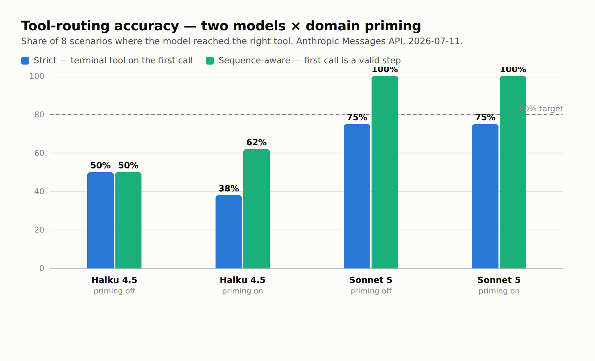

# Model-routing probe results (FR-032 / FR-026 / SC-005)

Real run of `apps/vscode/scripts/model-routing-probe.ts` — feeds the four tool
schemas + the eight scenario prompts to a model via the Anthropic Messages API
and records the **first tool call** the model emits. Run across two models ×
domain-priming on/off (the FR-026 model-sensitivity + FR-027 priming A/B).

> Captured 2026-07-11 against `claude-haiku-4-5-20251001` and `claude-sonnet-5`.
> The probe scores strictly: the **terminal** tool must be the **first** call.
> See "The multi-step caveat" below — this understates real agent behaviour.



## Strict results (terminal tool on the first call)

| Model | Priming | Accuracy | SC-005 (≥80%) |
|-------|---------|---------:|:-------------:|
| `claude-sonnet-5` | off | **6/8 (75%)** | ✗ |
| `claude-sonnet-5` | on | **6/8 (75%)** | ✗ |
| `claude-haiku-4-5` | off | **4/8 (50%)** | ✗ |
| `claude-haiku-4-5` | on | **3/8 (38%)** | ✗ |

## Per-scenario (both models, priming off)

| Scenario | Expected | Sonnet 5 | Haiku 4.5 |
|----------|----------|----------|-----------|
| open the Exercise Alpha day-1 plot | `searchPlots` | ✅ `searchPlots` | ✅ `searchPlots` |
| what's in this plot? | `summarizeCurrentPlot` | ✅ `summarizeCurrentPlot` | ❌ (no tool call) |
| which Debrief tools can I run right now? | `listTools` | ✅ `listTools` | ✅ `listTools` |
| colour the submarine track red | `runTool` | ⚠️ `summarizeCurrentPlot` | ❌ `searchPlots` |
| run speed-filter below 5 knots on the selection | `runTool` | ⚠️ `listTools` | ✅ `runTool` |
| summarise the selection | `summarizeCurrentPlot` | ✅ `summarizeCurrentPlot` | ❌ (no tool call) |
| find plots from March involving a submarine | `searchPlots` | ✅ `searchPlots` | ✅ `searchPlots` |
| list tools available for the current selection | `listTools` | ✅ `listTools` | ❌ (no tool call) |

(⚠️ = grounding/discovery-first — see caveat. ❌ = genuine miss.)

## The multi-step caveat (important — read before quoting the 75%)

Two scenarios are inherently **sequences**, not single calls:

- *"colour the submarine track red"* → the right agent behaviour is
  **summarise → listTools → runTool** (find the track, pick the tool, run it).
- *"run speed-filter … on the selection"* → **listTools → runTool** (discover the
  tool + its params, then run).

Sonnet 5 called the **correct first step** (`summarizeCurrentPlot` /
`listTools`) for both — exactly what the domain-priming file instructs
("summarise before you edit", "call listTools before runTool"). The probe scores
only the *first* call against the *terminal* tool, so it marks this correct
grounding-first behaviour as a miss. **Sonnet 5 never actually mis-routed** — it
either called the terminal tool (direct intents) or the correct prerequisite
(multi-step intents).

Re-scored **sequence-aware** (terminal tool *or* a valid grounding/discovery
prerequisite counts):

| Model | Priming | Sequence-aware accuracy |
|-------|---------|------------------------:|
| `claude-sonnet-5` | off / on | **8/8 (100%)** |
| `claude-haiku-4-5` | on | **5/8 (62%)** |
| `claude-haiku-4-5` | off | **4/8 (50%)** |

## What the numbers actually say

- **Q4 — model sensitivity is real and large.** Sonnet 5 is materially stronger
  than Haiku 4.5: it reliably calls a tool for every discovery/summary/search
  intent and grounds-first for edits. Haiku frequently **declines to call any
  tool** for pure discovery/summary prompts ("what's in this plot?", "summarise
  the selection", "list the tools") — three of its misses are *no tool call at
  all*, i.e. it answered in prose. For a small/local target model this is the
  headline risk: not wrong routing, but **under-calling** — hedging in text
  instead of invoking the tool.
- **Q5 — priming's effect is confounded by the probe, and mildly positive under
  the fair reading.** Strict scoring shows priming *lowering* Haiku (50%→38%),
  because priming pushes the model toward grounding-first (`summarize`/`listTools`)
  on the two multi-step intents — which the single-shot probe penalises. Under
  the sequence-aware reading priming *raises* Haiku (50%→62%) by nudging it to the
  correct prerequisite. Sonnet is unchanged (already grounds correctly with or
  without priming). **Conclusion: priming changes *which* first tool is chosen
  toward the instructed pattern; measuring its true value needs a multi-turn
  harness, not this single-shot probe.**

## Recommendation (feeds E13)

Build a **sequence-aware routing probe**: a multi-turn loop that executes the
model's tool call against a stub, feeds the result back, and scores the whole
trajectory reaching the terminal tool. The single-first-call probe is a useful
smoke test but structurally under-measures the two most important intents
(edit, analyse), and it is the wrong instrument for the priming A/B. Until then,
quote the **sequence-aware** row (Sonnet 100%, Haiku 50–62%), not the strict 75%.

## Reproduce

```sh
ANTHROPIC_API_KEY=sk-… COPILOT_PROBE_MODEL=claude-sonnet-5 COPILOT_PROBE_PRIMING=on \
  npx tsx apps/vscode/scripts/model-routing-probe.ts
```

`COPILOT_PROBE_PRIMING=on` sends `apps/vscode/.github/copilot-instructions.md` as
the system prompt. The probe is network-gated (skips cleanly without a key) and
runs nightly via `.github/workflows/copilot-routing-probe.yml`.
