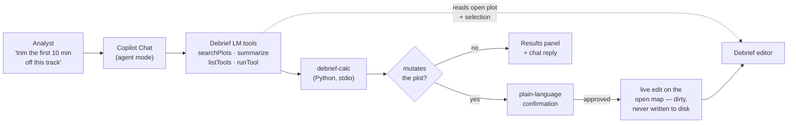

## What We're Building

I wanted to know what it feels like to *talk* to Debrief. So this spike wires GitHub Copilot Chat, in agent mode, directly into the VS Code extension: you type "find me the exercises off the Solent" or "trim the first ten minutes off this track", and Copilot does it — searching the local STAC catalogue, opening a plot, and running Debrief's own Python analysis tools against whatever you have open. The extension registers four tools with VS Code's Language Model Tools API, so Copilot discovers them the same way it discovers any other agent tool, and every call flows back through the extension — which means the chat always knows which plot is open and what you have selected.

The honest framing up front: this is an experiment, not a product. Copilot is cloud-backed, and Debrief's constitution is offline-by-default, so nothing here ships as-is. The point is to learn how a chat agent actually drives Debrief through a tool surface — where it stumbles, what a plot summary costs in tokens, how different models cope — so the real prize, an in-Debrief natural-language panel that runs against a *local* model, has something concrete to build on.

## How It Fits

This is the reconnaissance run for epic E13 — the offline NL panel (spike #235). Rather than inventing a bespoke chat surface to prototype against, it borrows one that already exists (Copilot agent mode) and points it at the tool boundary the future panel will also have to speak to. Search reuses the same `stacService.listItems` and `debrief.openPlot` command the file tree already uses; tool execution reuses the exact `debrief-calc` Python stdio path the Tools panel already drives. Everything Copilot-specific lives quarantined in a new `src/copilot/` folder, and the spike ships learning instrumentation — per-invocation telemetry, a token-budget probe, a multi-model comparison, a domain-priming A/B — all feeding a findings report that outlives the throwaway code.

## Key Decisions

- **Language Model Tools API over an MCP server or a `@debrief` chat participant.** All three could expose the tools, but only the extension-mediated LM Tools path lets each call carry live editor context — the open plot, the current selection — without the model having to name a file. That context is the whole reason the interaction feels like driving Debrief rather than querying a database.
- **Chat edits never touch disk.** This is the single most important safety decision. Where the Tools panel writes results straight to the STAC store, chat edits apply only to the open editor's in-memory features and mark the session dirty. You review and save exactly as you would a manual edit — nothing is written from a chat turn. Read tools auto-run; anything that *modifies* the plot gates on a plain-language confirmation first. Default-strict, defence-grade.
- **A meta-tool pair fronts the tool registry.** Rather than declaring every `debrief-calc` tool in `package.json` and churning it as the catalogue grows, two tools — `listTools` and `runTool` — expose the dynamic registry. The tool surface stays two entries wide no matter how many analysis tools sit behind it.
- **Engine bump to VS Code `^1.99.0`**, the release where agent-mode tool integration actually landed.
- **A known limitation, surfaced honestly:** the LM Tools API doesn't tell the extension which model is answering, so the multi-model comparison is operator-annotated rather than captured automatically. Worth recording, not worth hiding.
- **Deliberately throwaway.** The product of this spike is knowledge for its offline successor, not shipped code — so it is self-contained, disposable, and instrumented to teach rather than to last.

## What a Turn Actually Looks Like

The centrepiece is styling the open plot from chat. Here is the whole round-trip for one utterance — *"colour the submarine track red"* — with a track selected on the map.

First, Copilot grounds the request. It calls `debrief_summarizeCurrentPlot`, which returns a thinned inventory — feature names, types, platforms, time spans, counts, but no geometry — so the model can resolve "the submarine track" to a real feature id rather than guessing:

```json
{
  "plotId": "stac://store-1/items/alpha-day1/item.json",
  "title": "Exercise Alpha — Day 1",
  "features": [
    { "id": "track-1", "name": "HMS Nelson", "type": "TRACK", "platform": "HMS Nelson",
      "timeSpan": { "start": "2026-03-01T00:00:00Z", "end": "2026-03-01T06:00:00Z" }, "pointCount": 120 }
  ],
  "truncated": false,
  "approxTokens": 302
}
```

Then it discovers the tool via `debrief_listTools` (which projects the live registry with a derived `mutating` flag), and proposes a `debrief_runTool` call. Because `set-track-color` is a mutating tool, the confirmation gate fires — and the body is deliberately plain language, never raw JSON:

> **Run Set Track Color on Exercise Alpha — Day 1**
>
> **Set Track Color** will modify **Exercise Alpha — Day 1**.
> - Target: HMS Nelson
> - color: red
>
> The change is applied to the open editor and left unsaved (undo/revert to discard).

On approval, the tool re-validates the id and params against the live registry (an invented tool id is rejected before any Python process spawns), runs through the shared `calcService.executeTool` path, and applies the result to the open editor's features while marking the session dirty. It *omits* the Tools-panel's disk write. The map shows the track in red immediately; the plot is dirty; nothing was written to disk from the chat turn. That last clause is the one the whole design turns on.

The contrast cases are just as important. An analytical tool — *"run speed-filter below 5 kts"* — auto-runs with no confirmation and routes its result to the Results panel. And the fail-safes refuse rather than guess: *"colour the track red"* with nothing selected returns "Nothing is selected… (I will not guess)"; an invented tool id returns a corrective message and never spawns Python; no plot open returns "Search the catalog and open a plot first."

## What We Learned

The findings report answers six questions. The short version:

**Tool granularity — the hybrid split is the right shape.** Two static, purpose-built tools (`searchPlots`, `summarizeCurrentPlot`) carry rich descriptions so the model routes to them in a single call, while the `listTools`/`runTool` meta-pair keeps the contributed surface two entries wide no matter how many Python tools sit behind it. A new debrief-calc tool becomes usable from chat the moment it registers — no `package.json` churn. The cost is that `runTool` must re-validate the model's tool id and params itself, because the model can hallucinate ids; that validator, rejecting an invented tool with a corrective message and no Python spawn, is what makes the meta-pair safe.

**Context sufficiency — the thinned summary was enough, cheaply.** Names, types, platforms, time spans and counts let the model resolve "the submarine track" to a real id. Because the summary reports feature *counts* rather than geometry, cost scales with the number of features, not track length. The one gap: there's no per-feature *spatial* digest yet, so "the northern track" isn't answerable from the summary alone. Noted for E13.

**Confirmation friction — the plain-language gate is the right default, and over-gating is the acceptable failure mode.** Classification is category-driven (`calc`/`snapshot` auto-run; everything else gates), because a registry entry doesn't carry a tool's result type until it runs. An unknown-category tool is therefore *over*-gated — an extra confirmation — rather than under-gated. The real backstop is an invoke-time guard: a mutating result from a tool the gate classified as analytical *throws* rather than applying an unconfirmed edit.

**Transferability — high, and it's the deliverable that outlives the spike.** Search, execution, and the safety divergence are all Copilot-agnostic TypeScript. The offline panel reuses `searchCatalog`, `summarize`, `plotContext`, `applyChatEdit`, the registry, and the telemetry seams unchanged — only the *transport* (Copilot LM tools versus a local-model loop) gets replaced.

## Numbers, Not Vibes

Because the summary is what a local model has to swallow before it can act, its token cost is the number that decides whether an offline panel is even viable. The token-budget probe measured the shipped summariser over representative plot sizes:

| Plot | Features | Listed | Truncated | approxTokens |
|------|---------:|-------:|:---------:|-------------:|
| Small (3 tracks) | 8 | 8 | no | ~302 |
| Medium (12 tracks) | 32 | 32 | no | ~1,010 |
| Large (40 tracks) | 100 | 100 | no | ~3,064 |
| Very large (250 tracks) | 250 | 200 | **yes** | ~8,189 |

A typical tens-of-features plot sits comfortably inside even a 4k context window, leaving ample room for conversation. A very large plot approaches an 8k budget on the summary alone — which is exactly where the 200-feature inventory cap and the `truncated: true` flag earn their keep: they bound the worst case rather than letting it grow unbounded, and tell the model the list is partial so it can narrow scope instead of reasoning over a silently-cut list. The implication for E13: a 4k local model is viable for the common case *with* the cap; an 8k+ model handles the full ceiling.

## By the Numbers

| | |
|---|---|
| VS Code unit tests passing | 896 |
| New Copilot tests | 48 |
| Scripted-transcript scenarios (SC-002 gate) | 8 |
| Tests failed | 0 |
| Disk writes from a chat turn | 0 |

The whole Debrief side of the boundary is verified with no human and no LLM in the loop. The 48 Copilot tests plus an eight-scenario transcript replay — five happy-path, three fail-safe, run as canned tool calls — are the correctness gate, and they exercise the production code path: the no-disk-write invariant, the dirty-marking, the "decline applies nothing" guarantee, and the pre-dispatch rejection of invalid tool ids are all asserted against the real `runTool` invoke path.

## Lessons Learned, and the Honest Gaps

Three things blocked or bent, and I'd rather record them than bury them.

**Model identity is invisible to the tool.** The LM Tools API doesn't tell the extension which model is answering, so the multi-model comparison is operator-annotated. The spike closes the gap with an automated routing probe that owns the model choice and measures first-attempt tool-selection accuracy — but in this build session it skipped cleanly (no API key). A keyed nightly run produces the per-model table; until then, Q4 (model sensitivity) and Q5 (priming value) stay marked *live-pending*.

**Two verification layers are deferred.** Real-Python integration needs a provisioned debrief-calc interpreter, and the extension-host `vscode.lm.invokeTool` layer needs an Electron download that returned HTTP 403 in the cloud build session. Both are honestly deferred with written acceptance criteria for a follow-up on a properly-provisioned runner. The stated correctness gate — the transcript replay — is green, and the key invariants are proven at the unit layer against the production path.

**No live Copilot screenshots.** Copilot Chat can't be Playwright-driven, so there is no captured session here — the automated replay is the gate, and a licensed live session is supplementary follow-up. If this post feels light on pictures, that's why: I won't fabricate a screenshot of a session I couldn't automate.

One more, filed as a finding rather than a fix: the Debrief editor is a webview custom editor with app-managed session state, not VS Code's native undo stack, so "single undo" maps to the session revert mechanism. A declined or failed chat edit leaves the plot byte-identical because nothing is applied — that much is guaranteed and unit-proven. Whether an *applied-but-unsaved* chat edit reverts in a clean single step is the invariant the deferred extension-host layer is designed to exercise, and a gap the offline panel will need to close.

## What's Next

The recommendation to E13 is to adopt this tool surface as the contract for the offline NL panel. The static-plus-meta split, summarise-before-edit grounding, the plain-language confirmation gate, and the dirty-only apply all transfer. Two items to close first: a per-feature spatial digest in the summary, and the single-step-revert verification. And wiring the routing probe into nightly CI with a key turns the two *live-pending* findings into standing measurements.

The throwaway code did its job. The findings, the token numbers, and the tool boundary are what carry forward.

→ [See the code](https://github.com/debrief/debrief-future/pull/284)
